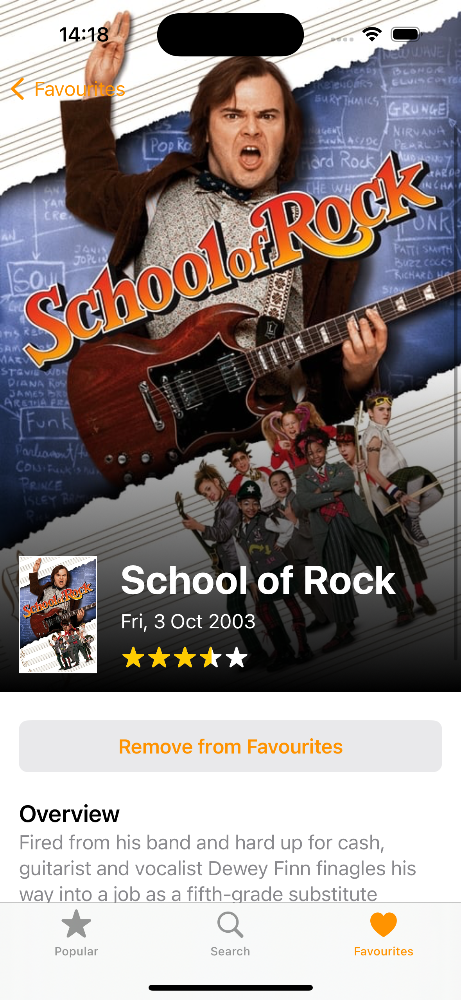

# Box Office

Box Office is an iOS application written entirely in  **Swift**.

It’s more than just your simple movie database! Take in the incredible poster art, see the release date, and check out the ratings, overview, and cast from each movie.
<br>
Find trending movies using the ‘Popular’ tab. Look for any movie you want in the ‘Search’ tab. Add movies to your favourites and get to them quickly in the ‘Favourites’ tab. Display your favourites in the way you want to see them by ordering them by default, alphabetically, or by release day.

   

Box Office makes use of the **SwiftUI** framework and follows the **MVVM** design pattern. The application features **Networking**, fetching movies from The Movie Database (TMDB) **API** and using **async/await** to obtain **JSON** from the server and displaying it in a visually pleasing way.

   

To run this application, clone the project and obtain an API key from https://developer.themoviedb.org. Once received, create a Constant.swift file inside the project and insert the following code replacing the API key with the one you just obtained.
<br>
```
struct Constants {
    static let apiKey = “YOUR API KEY HERE”
}
```
